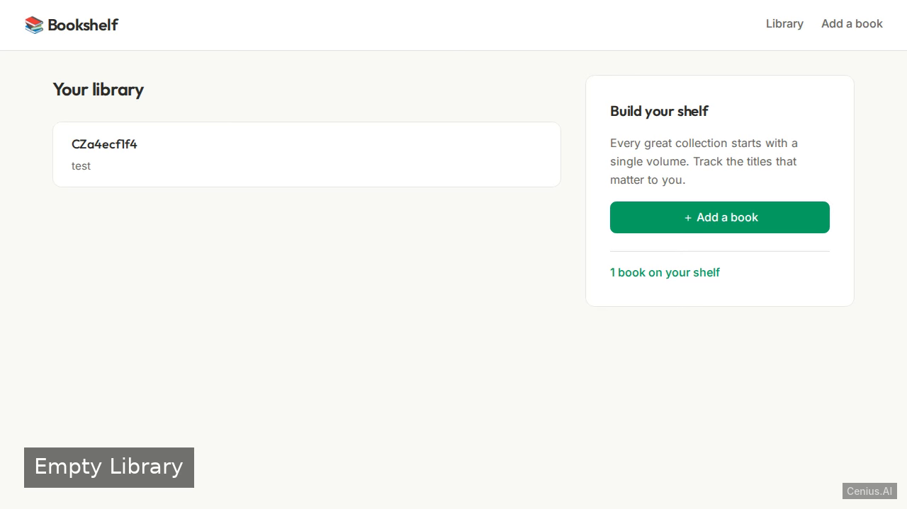
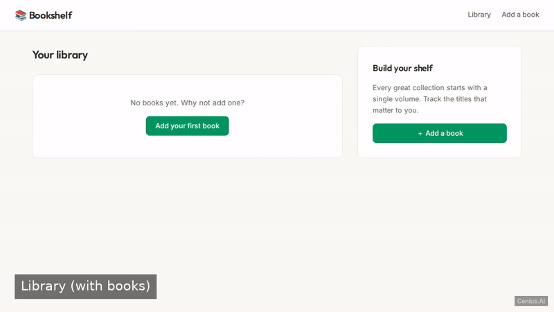
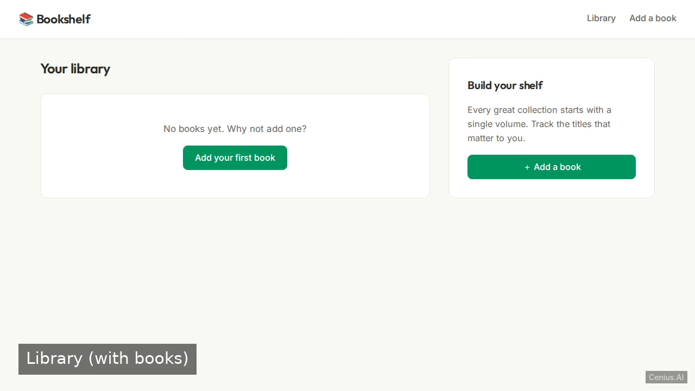
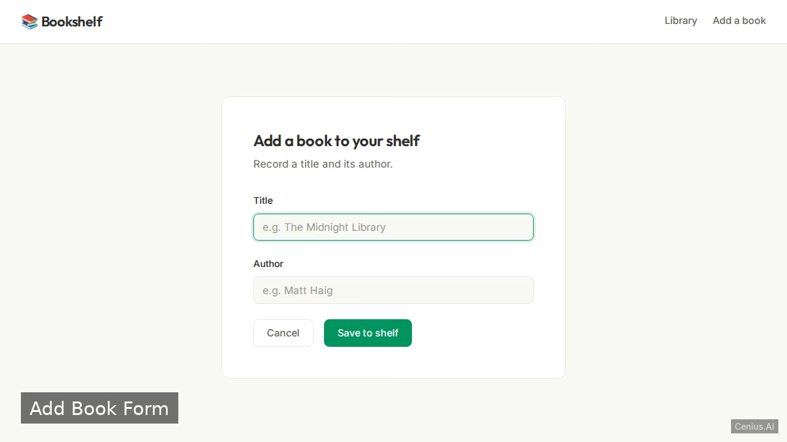

# Bookshelf — complete Clojure book to-do list example app

**Bookshelf** is a free, open-source book to-do list app built with Clojure. A small server-rendered web application in Clojure (Ring, Compojure, Hiccup) with a SQLite database (next.jdbc). Run it locally, deploy it as a self-hosted to-do list app, or [remix it on cenius.ai](https://cenius.ai/marketplace/p/bookshelf?ref=gh&utm_campaign=bookshelf-clojure) to make it your own — the whole application (code, design, seeded demo data) ships in this repository under the Apache-2.0 license.

[](LICENSE)  [](https://cenius.ai)

[](https://cenius.ai/marketplace/p/bookshelf?ref=gh&utm_campaign=bookshelf-clojure)

> **▶ [Open & edit in cenius.ai](https://cenius.ai/marketplace/p/bookshelf?ref=gh&utm_campaign=bookshelf-clojure)** — one click to an editable workspace: describe changes in plain English, get an instant preview, one-click deploy and host. Modifications made on the platform come with full rebrand & relicense rights.

_Local clone? See [Quick start](#quick-start) below. cenius.ai is the zero-setup path._

## Demo





▶ **[Watch the full demo video](https://cenius.ai/marketplace/p/bookshelf?ref=gh&utm_campaign=bookshelf-clojure)** — the complete walkthrough, playing on the project's cenius.ai page · [MP4 file](.github/media/demo.mp4)

## Screenshots

  

## Features

- View all books
- Add a new book
- Seed initial books

## Quick start

```bash
./install.sh   # installs dependencies + seeds demo data
```

See [`INSTALL.md`](INSTALL.md) for full setup and usage instructions.

## Usage guide

### 1. Starting the Server

Run the application:

```bash
clojure -M:run
```

Once started, the server listens on `http://localhost:8080`.

### 2. Viewing the Bookshelf

Open a browser and navigate to `http://localhost:8080`. The home page displays a list of all books with their titles and authors. A few sample books are pre-seeded.

Example with `curl`:

```bash
curl http://localhost:8080
```

Returns an HTML document containing the book list.

### 3. Adding a Book

The form on the same page allows adding a new book. Submit a POST request with `title` and `author` fields:

```bash
curl -X POST http://localhost:8080 \
     -d "title=The Hobbit&author=J.R.R. Tolkien"
```

After adding, the book appears on the home page.

### 4. Accessing Static Assets

CSS and font files are served from `resources/public/`:

- CSS: `http://localhost:8080/css/style.css`
- Font files (if `FONTS_DIR` is set): `http://localhost:8080/fonts/...`

A font CSS file is available at `/fonts/fonts.css` when `FONT_CSS_URL` is configured.

_Full guide: [`USAGE.md`](USAGE.md)_

## Architecture

Clojure application, delivered as a complete, runnable project (43 files). Top-level layout: `resources/`, `src/`. `install.sh` provisions dependencies and seeds demo data, so the app boots with something to show. Setup details live in [`INSTALL.md`](INSTALL.md).

## FAQ

### How do I run Bookshelf on my own server?

Clone this repository and run `./install.sh`, then start the app as described in [`INSTALL.md`](INSTALL.md). Bookshelf is fully self-hostable — no external services are required to try it.

### How can I customize Bookshelf without editing code?

Describe what you want changed on [cenius.ai](https://cenius.ai/marketplace/p/bookshelf?ref=gh&utm_campaign=bookshelf-clojure) — no code editing needed; the platform produces a fresh build you can download and deploy.

### What is Bookshelf built with?

Clojure. The full source in this repository is exactly what the app runs. Highlights include seed initial books.

### Is Bookshelf free for commercial use?

It is. Apache-2.0 licensing means you can build a product on it, sell it, or use it inside a company with no fees. Details: [LICENSE](LICENSE).

### How do I make Bookshelf my own brand?

Absolutely. [Open it on cenius.ai](https://cenius.ai/marketplace/p/bookshelf?ref=gh&utm_campaign=bookshelf-clojure) and remix it there — platform modifications come with full rebrand and relicense rights over your derivative, so the result is entirely yours.

## License & rebranding

Released under the [Apache License 2.0](LICENSE) (© 2026 Cenius AI) — free for personal and commercial use. The Cenius name/logo are trademarks (see NOTICE).

**Need a customized version?** [Remix this app on cenius.ai](https://cenius.ai/marketplace/p/bookshelf?ref=gh&utm_campaign=bookshelf-clojure) — modifications made on the platform come with **full rebrand & relicense rights** over your derivative.

## Built with cenius.ai

This entire application — code, design, seeded demo data — was generated on **[cenius.ai](https://cenius.ai)** from a plain-English description.

- 🚀 [Build your own app on cenius.ai](https://cenius.ai)
- 🎛️ [Remix Bookshelf on the marketplace](https://cenius.ai/marketplace/p/bookshelf?ref=gh&utm_campaign=bookshelf-clojure) — open it in a workspace, prompt for changes, and ship your own version.

More open-source apps: [the Cenius-ai catalog](https://github.com/Cenius-ai) · [showcase index](https://github.com/Cenius-ai/showcase)
